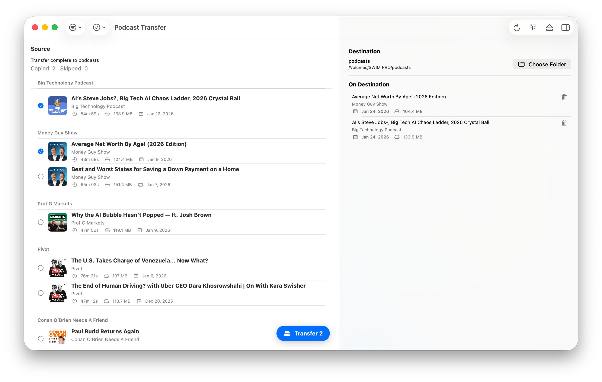

# Podcast Transfer

<p>
	
</p>

Transfer your Apple Podcasts downloads to any folder.

Podcast Transfer is a macOS app that finds episodes you’ve already downloaded in Apple Podcasts and copies them to another folder (for example: an external MP3 player, a NAS, or a backup drive).

<p>
	
</p>

## What it does

- Scans your local Apple Podcasts downloads and shows downloaded episodes.
- Lets you pick a destination folder.
- Copies episodes (audio files) to the destination.

## Privacy

- Podcast Transfer reads local files and local metadata to identify downloaded episodes.
- No data leaves your Mac.

## Requirements

- macOS 14+
- Apple Podcasts with downloaded episodes

## Where it looks

Apple Podcasts downloads live under Apple’s Group Container. Podcast Transfer scans:

`~/Library/Group Containers/243LU875E5.groups.com.apple.podcasts/Library/Podcasts`

## Installing

Releases are published on GitHub:

- https://github.com/ajevans99/podcast-transfer/releases

## Building from source (for contributors)

1. Install XcodeGen (if you don’t have it):

```
brew install xcodegen
```

2. Generate the Xcode project:

```
make xcodegen
open App/PodcastTransfer.xcodeproj
```

3. Build and run the macOS app scheme `PodcastTransfer`.

### Testing

- Unit + snapshot tests: `make test`
- Snapshot recording: run with `SNAPSHOT_TESTING_RECORD=all` once, then re-run normally

### Tooling

- Format: `make format`
- Lint: `make lint`

## Project structure

- PodcastTransferCore — models, library scanning client, transfer client, destination store
- PodcastTransferFeature — view model orchestration
- PodcastTransferUI — SwiftUI views (list, destination picker, transfer status)
- PodcastTransferApp — macOS app entry point
- Playground — small CLI harness for preview data

## Dependencies

- [swift-dependencies](https://github.com/pointfreeco/swift-dependencies)
- [swift-sharing](https://github.com/pointfreeco/swift-sharing)
- [swift-snapshot-testing](https://github.com/pointfreeco/swift-snapshot-testing) (UI snapshots)
